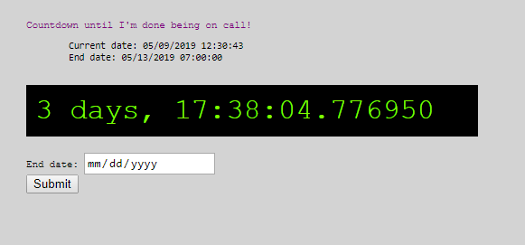

## COUNTDOWN
This is an app that lets you set the end date to a date you want to countdown to. It defaults the end date to 7 am when you select it.

### Version
* Python 3.6.5
* Flask 0.12.2

### Screenshot
